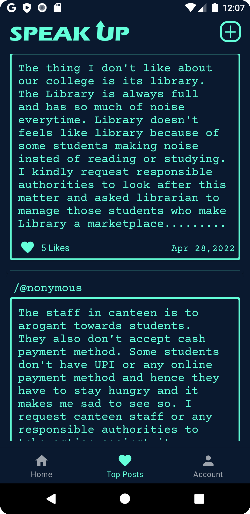
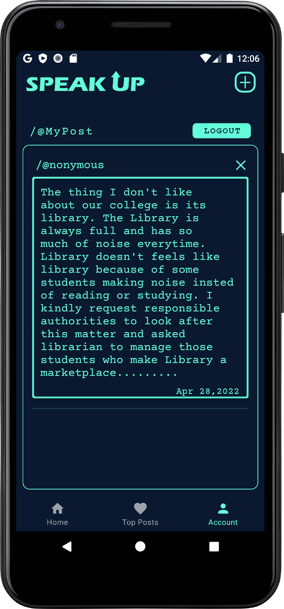

## About Speak-Up  
Speak-Up is a native android application to express your thoughts without being judge.
The app hides your identity while posting/raising an issue regarding college campus.
This anonymity helps students to put their thoughts forward to respected college authorities.
The key feature of app is the "Top Posts" feature which shows the post/issue with most number of likes at the top. 
This depicts that the same problem is faced by many students and should be taken into consideration.

## Gallery
|Login Screen|Signup Screen|Home Screen|
|-------|-------|-------|
||||

|Top Posts Screen|Account Screen|Add Post Screen|
|-------|-------|-------|
||||

## Build The Code
1. Clone the repository https://github.com/hiteshshimpi-55/Speak-Up.git
2. Open Android Studio.
3. Click on 'Open an existing Android Studio project'.
4. Browse to the directory where you cloned the project, choose frontend and click OK.
5. Let Android Studio import the project and you are good to go!

## Contribution Guidelines
1. All issues should be raised via GitHub issue tracker and should follow the issue template
2. All changes should be proposed via Pull Requests and should follow the pull request template
3. Commit messages should be appropriate and must reflect/describe the changes made
4. One commit should have only one change although it may involve changes in multiple files

## How To Contribute
1. Fork the project
2. Make your changes and push the changes to your forked repository
3. Raise a pull-request dev branch and ensure the pull request follows the template.
4. At the moment we are adding all the new features to the dev branch, and pushing only fully features to our master branch.

## Documentation
- Language: Java             link: https://docs.oracle.com/en/java/
- Database: Firebase         link: https://firebase.google.com/docs/android/
- TechStack: Android Studio  link: https://developer.android.com/docs

## Maintainer
- [Hitesh Shimpi](https://github.com/hiteshshimpi-55)
